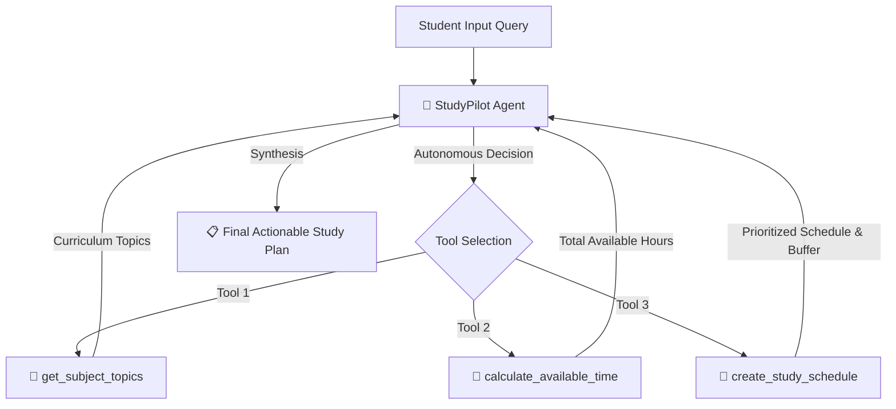

# 🌱 StudyPilot — Agentic Study Planner

> **Bharat Agentic 2026 Hackathon Project**  
> An autonomous agentic EdTech application that converts student study constraints into structured, realistic, and prioritized study plans using real tool-calling LLMs.

---

## 1. Project Name
**StudyPilot — Agentic Study Planner**

---

## 2. Problem Statement
Students facing upcoming exams frequently struggle with unstructured preparation:
- Overwhelmed by vast syllabi and uncertain about how to prioritize topics.
- Difficulty estimating realistic study capacity given tight deadlines and daily hour limits.
- Neglecting weak areas or failing to allocate sufficient time for dedicated revision and mock practice.
- Static study schedules or generic advice often fail to adapt dynamically to student-specific constraints.

---

## 3. Solution Overview
**StudyPilot** is an agentic study planner designed specifically for students. Instead of relying on a rigid, hardcoded scheduling pipeline or a generic conversational reply, StudyPilot deploys an autonomous AI agent backed by Groq that:
1. Understands individual exam deadlines, available daily hours, and subject weaknesses.
2. Dynamically queries its curriculum knowledge base to identify standard exam topics.
3. Performs computational calculations to establish exact available study time.
4. Generates a weighted time allocation that prioritizes weaker topics and reserves dedicated revision buffers.
5. Returns a structured, day-by-day roadmap with realistic hourly milestones.

---

## 4. Why It Is Agentic
Traditional programs rely on fixed, sequential procedural logic (Step A -> Step B -> Step C). In contrast, **StudyPilot is genuinely agentic**:
- **Autonomous Decision-Making**: The LLM model dynamically evaluates the user's natural language input, chooses which tools to invoke, extracts appropriate parameters, and sequences its own execution.
- **Dynamic Tool / Function Calling**: Tools are exposed as standard schemas to the LLM via the Groq API. The LLM decides whether and when to call `get_subject_topics`, `calculate_available_time`, and `create_study_schedule`.
- **Iterative Feedback Loop**: The agent observes tool outputs in its context window before reasoning about subsequent steps or finalizing the schedule.
- **Goal-Directed Synthesis**: The agent maintains the high-level goal of creating a feasible, balanced, and student-focused plan without hardcoded tool execution scripts.

---

## 5. Agent Workflow



1. **User Request**: The student inputs their subject, remaining days, daily hours, and weak topics.
2. **Analysis**: The Groq agent evaluates the constraints and decides which tools to call.
3. **Tool Invocation**: Tools execute and return structured data back to the agent conversation history.
4. **Processing & Synthesis**: The agent incorporates tool results into a structured, day-by-day plan with revision buffers.
5. **Output**: The student receives both a real-time agent action log and a finalized, actionable study plan.

---

## 6. Tools

StudyPilot equips the agent with three purpose-built tools:

| Tool | Purpose | Parameters | Returns |
| :--- | :--- | :--- | :--- |
| `get_subject_topics` | Retrieves the official core syllabus topics for common engineering and computer science subjects (Python, C Programming, Data Structures, Java, Computer Organization & Architecture, DBMS). | `subject` (string) | Predefined, structured topic list and subject metadata. |
| `calculate_available_time` | Accurately calculates total available study hours over the preparation window. | `days` (number), `hours_per_day` (number) | Total available study hours and input breakdown. |
| `create_study_schedule` | Allocates study hours across topics using weighted prioritization (1.75x weight for weak areas) and reserves a 20% revision/mock-test buffer. | `topics` (array), `total_hours` (number), `weak_topics` (array) | Structured topic allocation, revision hours, and priority tags. |

---

## 7. Technology Stack
- **Language**: Python 3.13
- **User Interface**: Streamlit (lightweight, interactive web UI with real-time agent activity logs)
- **Agent Inference Engine**: Groq Python SDK (`openai/gpt-oss-120b` with automated fallback support to `openai/gpt-oss-20b`)
- **Environment Management**: `python-dotenv` for secure environment variable handling
- **Version Control**: Git

*Note: In accordance with the hackathon requirements, no external databases, multi-agent frameworks, authentication layers, RAG pipelines, or external vector stores were used.*

---

## 8. How to Run Locally

### Prerequisites
- Python 3.13+ installed
- Git installed
- A valid Groq API key

### Steps

1. **Clone the repository and enter the directory**:
   ```bash
   git clone <repository-url>
   cd study-planner-agent
   ```

2. **Create and activate a virtual environment**:
   ```bash
   python -m venv .venv
   # Windows PowerShell:
   .\.venv\Scripts\Activate.ps1
   # macOS/Linux:
   source .venv/bin/activate
   ```

3. **Install dependencies**:
   ```bash
   pip install -r requirements.txt
   ```

4. **Configure your API key**:
   Create a `.env` file in the project root:
   ```env
   GROQ_API_KEY=your_actual_groq_api_key_here
   ```
   *(You can also copy from `.env.example`: `cp .env.example .env`)*

5. **Launch the application**:
   ```bash
   streamlit run app.py
   ```

6. Open your browser and navigate to `http://localhost:8501`.

---

## 9. Example Query
Try testing with the hackathon benchmark query:
> *"I have a Python exam in 5 days. I can study 3 hours per day. I am weak in OOP and file handling. Make me a study plan."*

Expected behavior:
- Agent Activity logs show real tool invocations:
  - 🧠 Analyzing study request
  - 🔧 Calling `get_subject_topics`
  - 🔧 Calling `calculate_available_time`
  - 🔧 Calling `create_study_schedule`
  - ✅ Processing tool results
  - ✅ Study plan generated
- Generates a day-by-day schedule with 15 total hours, weighted focus on OOP and File Handling, and reserved revision time on Day 4 and Day 5.

---

## 10. Responsible AI & Limitations
- **Educational Assistant Only**: StudyPilot is an automated organizational and study-planning assistant. It does **not** claim to provide professional educational advice, accredited academic counseling, or guarantees of exam performance.
- **Human-in-the-Loop**: Students should review and tailor the generated plan according to their unique energy levels, university-specific syllabi, and academic requirements.
- **Fair Resource Allocation**: Time distribution algorithms apply transparent heuristic weights without discriminatory assumptions.

---

## 11. Disclosure of Third-Party Technologies
- **Groq**: Used as the high-speed inference platform for LLM function calling.
- **Open-Source Python Libraries**:
  - `streamlit` for frontend interface and reactive component rendering.
  - `groq` official Python client for API communication.
  - `python-dotenv` for local environment configuration management.
